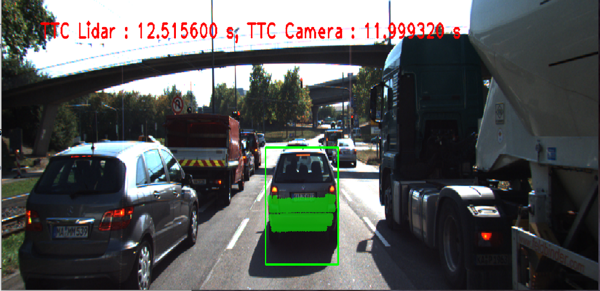
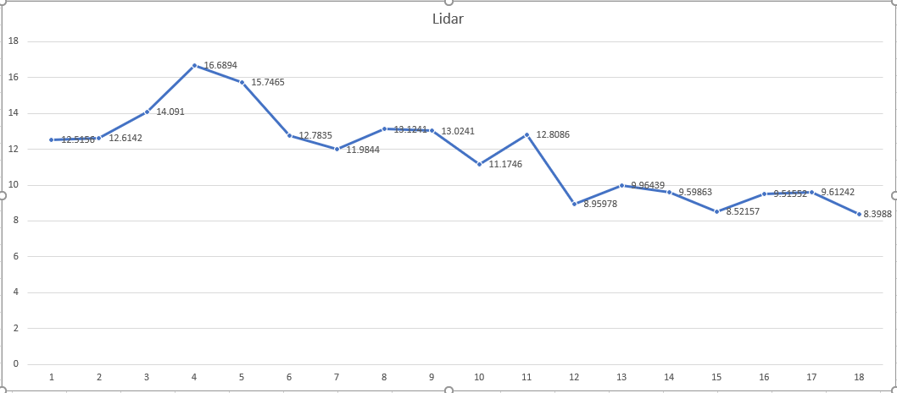
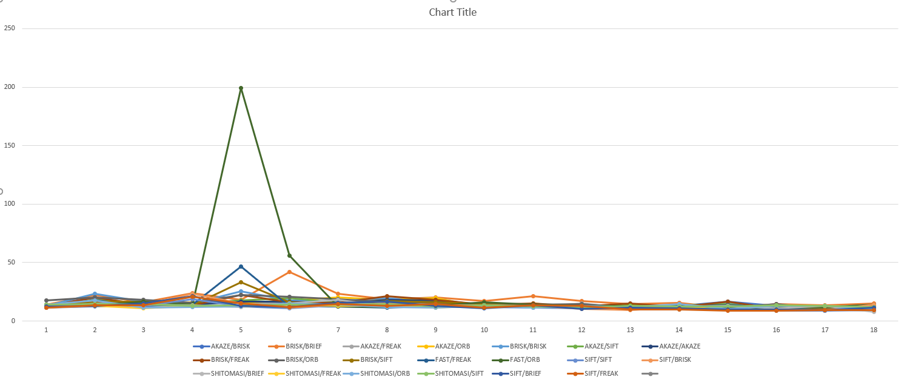
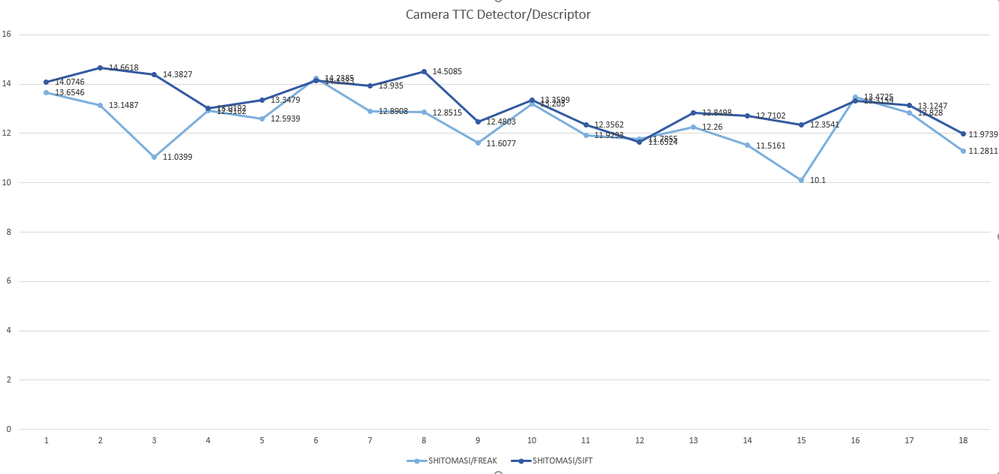

# SFND 3D Object Tracking



## Refactoring / Data Collection

Stuffing all functionality into the main loop makes it difficult to read/modify code. Significant refactoring has been done with a goal to separate the main function from initialization & staging code (such as creating transformation matrices and loading images). The loop itself has been migrated to `track3d.cpp`

This refactoring allows for efficient data collection required by FP.5 and FP.6 in a single run

## FP.1 Match 3D Objects

We first identify all possible matches and store them in a staging data structure which is `std::unordered_map<int, std::unordered_map<int, int>>` - a dictionary of dictionaries. It maps `prev_box_id -> (cur->box_id -> number_of_matches)`. Once this is built, we transform it into the output `prev_box_id->cur_box_id` by reducing the value part of the staged dictionary to its maximum element.

## FP.2 Compute Lidar-based TTC

For each cluster of LIDAR points we compute median distances (previous and current).
Perhaps not the best idea, as in such computations as TTC it is always good to err on the side of caution. On the other hand being too cautios does not make for a great driving experience if the car is going to force-break more often than expected.

## FP.3 Associate Keypoint Correspondences with Bounding Boxes

`DataFrame` stores bounding boxes in a `std::vector<BoundingBox>`. It would probably be better to store them in an `unordered_map` instead. This would eliminate some ugly loops. I did not make this change as it would drag quite a few more changes with it.

Used the mean distance between current and previous point to grab relevant matches. If we assume that most matches are correct, and given a relatively short period between successive frames, points should not deviate far from their mean.

## FP.4 Compute Camera-based TTC

Code from the exercise. Accumulate distance ratios and grab the median for distance computation

## FP.5 Performance Evaluation 1
Data in [lidar.csv](doc/lidar.csv)



The application can be run with lidar visualization only:

```cpp
  Track3d tracker(string(DetectorTypes::FAST), string(DescriptorTypes::ORB), (int)Track3d::Visualize::Lidar);
  tracker.run_tracking_loop();
```

The lidar points visualization will show that the distance from the lidar to the car in front gradually diminishes (from 7.97 m, going down each frame), although we still do not know how fast between the snapshots. Given that we are taking a **median** distance value for our TTC estimate (perhaps not a good idea to begin with), we are avoiding any anomaly that I can detect.

## FP.6 Performance Evaluation 2

Data: [camera.csv](doc/camera.csv). Out of 35 pairings of detector/descriptor we eliminate all of Harris-based entries as well as all entries with "inf" or "-inf" computation results.

This gives us 21 pairs:



After filtering out the clearly wrong series and further reducing to the series that roughly corelate with lidar data we are left with 2 pairs: Shi-Tomasi/FREAK and Shi-Tomasi/SIFT




These illustrate insufficiencies of the analytical computer vision when applied to this problem. Lighting conditions change from frame to frame so RGB sensor data may vary drastically and thus the number of keypoints and their matches becomes very unreliable. More robust computation is definitely needed before we trust these sensors with driving autonomously, but it is a good start!